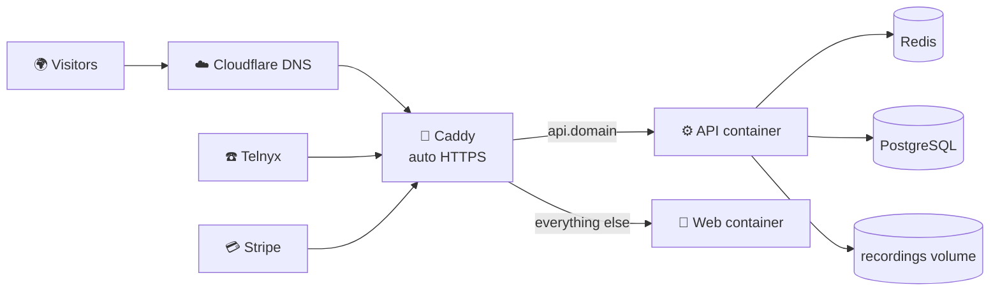

# 🚀 Deploying ViaRoute (Stage 2 → Stage 3)

Everything needed to run ViaRoute on a server is in this repo. This guide is the
step-by-step for PLAN.md Steps 7–13.



| File | What it is |
|---|---|
| `apps/api/Dockerfile` | API image — runs DB migrations on start, then the API (routing, billing jobs, postbacks) |
| `apps/web/Dockerfile` | Web portal image (Next.js standalone) |
| `infra/docker-compose.prod.yml` | Caddy + API + web + Redis (+ optional Postgres with daily backups) |
| `infra/Caddyfile` | HTTPS for the main site, all `*.domain` portals and verified custom domains |
| `.env.production.example` | Every production setting, documented |
| `.github/workflows/ci.yml` | Tests → images → staging → (approval) → production |

---

## 0a. xCloud / Coolify ("Deploy via Git", one port)

The root `docker-compose.yml` runs everything behind one port (**8080**): web app, API at `/api`, test inbox at `/mail`.

| Setting | Value |
|---|---|
| Deploy with | `docker-compose.yml` |
| Docker Compose file | `docker-compose.yml` |
| Port | `8080` |

Environment variables: turn on **Environment File** and paste these three lines (without it, the deploy fails with `required variable … is missing a value`):

```
APP_DOMAIN=royal-dream.1wp.site
ADMIN_EMAIL=you@example.com
ADMIN_PASSWORD=a-long-password
```

| Name | Value |
|---|---|
| `APP_DOMAIN` | the domain the platform gives the app (no `https://`) |
| `ADMIN_EMAIL` | your Super Admin login, created on first start |
| `ADMIN_PASSWORD` | 12+ characters; also the test inbox password at `/mail/` (user `admin`) |

Customer portals under another domain than the admin site: add `PORTAL_DOMAIN`. Example — admin at
`viaroute.psoni.in`, customers at `acme.psoni.in`: `APP_DOMAIN=viaroute.psoni.in` and `PORTAL_DOMAIN=psoni.in`
(DNS: `viaroute` and `*` → server; the server's web proxy must send both to port 8080).

`JWT_SECRET` and `ENCRYPTION_KEY` are generated on the first start and kept in the `secrets` volume (set them yourself to override).
The database is only reachable inside the stack; to choose its password, set `POSTGRES_PASSWORD` before the first deploy.
Optional: `SMTP_URL` / `MAIL_FROM` for real email, `STRIPE_SECRET_KEY` / `STRIPE_WEBHOOK_SECRET`.
Carrier webhook URLs (Admin → Carriers) come out as `https://<APP_DOMAIN>/api/webhooks/…`.

**Limit:** customer portals live on subdomains (`acme.<APP_DOMAIN>`). They only work if the platform sends
`*.<APP_DOMAIN>` to this app with a wildcard certificate; a single staging domain doesn't. For full
multi-customer hosting use your own server with `infra/docker-compose.prod.yml` (section 4).

## 0. Quick trial on a server IP (no domain yet)

Try the whole app on a fresh Ubuntu server before setting up a domain and HTTPS.
[sslip.io](https://sslip.io) makes `anything.<IP>.sslip.io` point at your server, so customer portals on subdomains work.

```bash
curl -fsSL https://get.docker.com | sh                 # Docker + Compose plugin
git clone https://github.com/prakash99349/ViaRoute.git /opt/viaroute && cd /opt/viaroute
cp infra/.env.trial.example .env.trial
sed -i "s/^SERVER_IP=.*/SERVER_IP=$(curl -s -4 ifconfig.me)/" .env.trial
sed -i "s/^POSTGRES_PASSWORD=.*/POSTGRES_PASSWORD=$(openssl rand -hex 32)/" .env.trial
sed -i "s/^JWT_SECRET=.*/JWT_SECRET=$(openssl rand -hex 48)/" .env.trial
sed -i "s/^ENCRYPTION_KEY=.*/ENCRYPTION_KEY=$(openssl rand -hex 32)/" .env.trial
docker compose -f infra/docker-compose.trial.yml --env-file .env.trial up -d --build
docker compose -f infra/docker-compose.trial.yml --env-file .env.trial exec api node dist/cli/create-admin.js you@example.com 'a-long-password'
```

Open `http://<IP>.sslip.io:3000` and log in with the email and password above. Customer portals: `http://<name>.<IP>.sslip.io:3000`.
Emails (verification, invites) land in the test inbox at `http://<IP>:8025`. Open ports 3000, 4000 and 8025 in the firewall.
Calls use the built-in Test carrier. Stop with `docker compose -f infra/docker-compose.trial.yml --env-file .env.trial down` (add `-v` to delete the data).

## Launch setup (up to ~1,000–2,000 live calls)

| Piece | Size | Where (example) | Setting |
|---|---|---|---|
| App server | 8 vCPU / 16 GB, dedicated (not shared) | DigitalOcean / Hetzner / Vultr, **US-East** (near the carriers) | runs `infra/docker-compose.prod.yml` |
| PostgreSQL 17 | 4 vCPU / 16 GB, daily backups + point-in-time restore | DigitalOcean Managed DB (same region) | `DATABASE_URL` (`sslmode=require`) |
| Redis / Valkey | 1–2 GB, fixed-price plan | DigitalOcean Managed Valkey (same region) | `REDIS_URL` (`rediss://…`) |
| Recordings | pay per GB | Cloudflare R2 bucket + API token (Object Read & Write) | `S3_BUCKET`, `S3_ENDPOINT`, `S3_ACCESS_KEY_ID`, `S3_SECRET_ACCESS_KEY` |

Avoid per-request-priced Redis (e.g. Upstash pay-as-you-go): the job queue polls constantly.
Restrict the database and Redis to the app server's IP (trusted sources). Recording links are short-lived signed URLs;
the bucket stays private.

## 1. Accounts & keys (before the server)

- [ ] **Domain** in **Cloudflare** (e.g. `viaroute.com`)
- [ ] **Telnyx** (production, KYC done): API key, **public key** (Keys & Credentials), and a **Call Control Application**
      whose webhook URL is `https://api.viaroute.com/webhooks/telnyx` → its id is `TELNYX_CONNECTION_ID`
- [ ] **Stripe** (live): secret key; add webhook `https://api.viaroute.com/webhooks/stripe` for
      `checkout.session.completed` and `checkout.session.async_payment_succeeded` → signing secret
- [ ] **Email**: Resend (or SES) SMTP credentials, sending domain verified
- [ ] **Database**: managed PostgreSQL 17 (DigitalOcean / Neon / RDS) with daily backups — or use `--profile local-db`

## 2. Server (Hetzner / DigitalOcean, Ubuntu 24.04, 4 vCPU / 8 GB)

```bash
# as root, once
adduser deploy && usermod -aG sudo deploy
rsync --archive --chown=deploy:deploy ~/.ssh /home/deploy      # your SSH key
sed -i 's/^#\?PasswordAuthentication.*/PasswordAuthentication no/' /etc/ssh/sshd_config && systemctl restart ssh
ufw allow OpenSSH && ufw allow 80 && ufw allow 443 && ufw --force enable
apt update && apt install -y fail2ban unattended-upgrades
curl -fsSL https://get.docker.com | sh && usermod -aG docker deploy
```

## 3. DNS (Cloudflare)

| Type | Name | Value | Proxy |
|---|---|---|---|
| A | `viaroute.com` | server IP | DNS only ⚪ |
| A | `*.viaroute.com` | server IP | DNS only ⚪ |
| A | `api.viaroute.com` | server IP | DNS only ⚪ |
| A | `domains.viaroute.com` | server IP | DNS only ⚪ (customers CNAME their domains here) |

> Keep records **DNS only** (grey cloud) so Caddy can issue certificates for every tenant subdomain and custom domain.

## 4. First deploy

```bash
ssh deploy@SERVER
sudo mkdir -p /opt/viaroute && sudo chown deploy /opt/viaroute && cd /opt/viaroute
git clone https://github.com/YOUR_ORG/viaroute.git .
cp .env.production.example .env.production && nano .env.production     # fill every value
docker compose -f infra/docker-compose.prod.yml --env-file .env.production up -d --build
# add  --profile local-db  to both commands if Postgres runs on this server
docker compose -f infra/docker-compose.prod.yml logs -f api            # "API ready", migrations applied
```

Create your Super Admin and the default plans (run again any time to reset that password):

```bash
docker compose -f infra/docker-compose.prod.yml exec api node dist/cli/create-admin.js you@viaroute.com 'a-long-password'
```

Log in at `https://viaroute.com/login`. (Don't run `pnpm db:seed` in production — it creates the demo tenant.)

## 5. Automatic deploys (GitHub)

Repository → Settings:

- **Variables**: `ROOT_DOMAIN = viaroute.com`
- **Environments**: `staging` and `production` (add yourself as *required reviewer* on production)
- **Secrets**: `STAGING_HOST`, `PRODUCTION_HOST`, `DEPLOY_USER` (= `deploy`), `DEPLOY_SSH_KEY`

Every push to `main`: tests → Docker images (GHCR) → staging → your approval → production.

## 6. Monitoring & backups

- [ ] **Uptime**: Better Stack / UptimeRobot on `https://api.viaroute.com/health` (1 min, SMS/Telegram alert)
- [ ] **Errors**: add Sentry DSN (API + web) — optional next step
- [ ] **Backups**: managed DB daily backups, or `infra/backups/` from the `backup` service (30 days) — **test a restore once**
- [ ] **Recordings**: stored in the `recordings` Docker volume; include it in server backups (move to Cloudflare R2 when volume grows)

## 7. Go-live checklist (PLAN Step 12)

- [ ] `TELNYX_*` and `STRIPE_*` are **live** keys; webhooks show 200 in both dashboards
- [ ] Buy one real number, call it from your phone, check routing, recording and billing; then release it
- [ ] Make a $10 real card top-up, confirm it lands in the wallet
- [ ] Custom domain test with an Enterprise tenant (CNAME → `domains.viaroute.com`, Verify, open https)
- [ ] Terms, Privacy, Acceptable Use pages; recording-consent wording checked by a lawyer
- [ ] Status page + support email/chat
