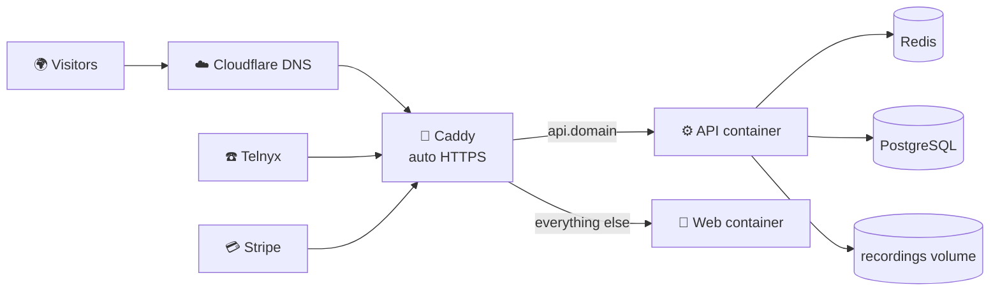

# 🚀 Deploying ViaRoute (Stage 2 → Stage 3)

Everything needed to run ViaRoute on a server is in this repo. This guide is the
step-by-step for PLAN.md Steps 7–13.



| File | What it is |
|---|---|
| `apps/api/Dockerfile` | API image — runs DB migrations on start, then the API (routing, billing jobs, postbacks) |
| `apps/web/Dockerfile` | Web portal image (Next.js standalone) |
| `infra/docker-compose.prod.yml` | Caddy + API + web + Redis (+ optional Postgres with daily backups) |
| `infra/Caddyfile` | HTTPS for the main site, all `*.domain` portals and verified custom domains |
| `.env.production.example` | Every production setting, documented |
| `.github/workflows/ci.yml` | Tests → images → staging → (approval) → production |

---

## 1. Accounts & keys (before the server)

- [ ] **Domain** in **Cloudflare** (e.g. `viaroute.com`)
- [ ] **Telnyx** (production, KYC done): API key, **public key** (Keys & Credentials), and a **Call Control Application**
      whose webhook URL is `https://api.viaroute.com/webhooks/telnyx` → its id is `TELNYX_CONNECTION_ID`
- [ ] **Stripe** (live): secret key; add webhook `https://api.viaroute.com/webhooks/stripe` for
      `checkout.session.completed` and `checkout.session.async_payment_succeeded` → signing secret
- [ ] **Email**: Resend (or SES) SMTP credentials, sending domain verified
- [ ] **Database**: managed PostgreSQL 17 (DigitalOcean / Neon / RDS) with daily backups — or use `--profile local-db`

## 2. Server (Hetzner / DigitalOcean, Ubuntu 24.04, 4 vCPU / 8 GB)

```bash
# as root, once
adduser deploy && usermod -aG sudo deploy
rsync --archive --chown=deploy:deploy ~/.ssh /home/deploy      # your SSH key
sed -i 's/^#\?PasswordAuthentication.*/PasswordAuthentication no/' /etc/ssh/sshd_config && systemctl restart ssh
ufw allow OpenSSH && ufw allow 80 && ufw allow 443 && ufw --force enable
apt update && apt install -y fail2ban unattended-upgrades
curl -fsSL https://get.docker.com | sh && usermod -aG docker deploy
```

## 3. DNS (Cloudflare)

| Type | Name | Value | Proxy |
|---|---|---|---|
| A | `viaroute.com` | server IP | DNS only ⚪ |
| A | `*.viaroute.com` | server IP | DNS only ⚪ |
| A | `api.viaroute.com` | server IP | DNS only ⚪ |
| A | `domains.viaroute.com` | server IP | DNS only ⚪ (customers CNAME their domains here) |

> Keep records **DNS only** (grey cloud) so Caddy can issue certificates for every tenant subdomain and custom domain.

## 4. First deploy

```bash
ssh deploy@SERVER
sudo mkdir -p /opt/viaroute && sudo chown deploy /opt/viaroute && cd /opt/viaroute
git clone https://github.com/YOUR_ORG/viaroute.git .
cp .env.production.example .env.production && nano .env.production     # fill every value
docker compose -f infra/docker-compose.prod.yml --env-file .env.production up -d --build
# add  --profile local-db  to both commands if Postgres runs on this server
docker compose -f infra/docker-compose.prod.yml logs -f api            # "API ready", migrations applied
```

Create your Super Admin and the default plans (run again any time to reset that password):

```bash
docker compose -f infra/docker-compose.prod.yml exec api node dist/cli/create-admin.js you@viaroute.com 'a-long-password'
```

Log in at `https://viaroute.com/login`. (Don't run `pnpm db:seed` in production — it creates the demo tenant.)

## 5. Automatic deploys (GitHub)

Repository → Settings:

- **Variables**: `ROOT_DOMAIN = viaroute.com`
- **Environments**: `staging` and `production` (add yourself as *required reviewer* on production)
- **Secrets**: `STAGING_HOST`, `PRODUCTION_HOST`, `DEPLOY_USER` (= `deploy`), `DEPLOY_SSH_KEY`

Every push to `main`: tests → Docker images (GHCR) → staging → your approval → production.

## 6. Monitoring & backups

- [ ] **Uptime**: Better Stack / UptimeRobot on `https://api.viaroute.com/health` (1 min, SMS/Telegram alert)
- [ ] **Errors**: add Sentry DSN (API + web) — optional next step
- [ ] **Backups**: managed DB daily backups, or `infra/backups/` from the `backup` service (30 days) — **test a restore once**
- [ ] **Recordings**: stored in the `recordings` Docker volume; include it in server backups (move to Cloudflare R2 when volume grows)

## 7. Go-live checklist (PLAN Step 12)

- [ ] `TELNYX_*` and `STRIPE_*` are **live** keys; webhooks show 200 in both dashboards
- [ ] Buy one real number, call it from your phone, check routing, recording and billing; then release it
- [ ] Make a $10 real card top-up, confirm it lands in the wallet
- [ ] Custom domain test with an Enterprise tenant (CNAME → `domains.viaroute.com`, Verify, open https)
- [ ] Terms, Privacy, Acceptable Use pages; recording-consent wording checked by a lawyer
- [ ] Status page + support email/chat
