# 📞 ViaRoute — Master Build Plan

> **Pay-per-call tracking & routing platform (Ringba-style), sold as a multi-tenant white-label SaaS.**
> Each customer gets their own private portal: `customer.viaroute.com` (or their own domain).

| | |
|---|---|
| **Approach** | 🖥️ Build locally → 🛠️ Server setup → 🚀 Go live |
| **Target start** | 2026-10-01 |
| **Target public launch** | ~Feb–Mar 2027 (4–5 months) |
| **Team (suggested)** | 2–3 developers + you (product / sales) |

---

## 📑 Contents

1. [The Big Picture](#-1-the-big-picture)
2. [Timeline (Gantt)](#-2-timeline)
3. [System Architecture](#-3-system-architecture)
4. [How a Call Flows](#-4-how-a-call-flows)
5. [Users & Roles](#-5-users--roles)
6. [Database Design](#-6-database-design)
7. [Stage 1 — Build Locally](#-stage-1--build-locally-1216-weeks)
8. [Stage 2 — Server Setup](#-stage-2--server-setup-12-weeks)
9. [Stage 3 — Go Live](#-stage-3--go-live-24-weeks)
10. [Difficulties & Solutions](#-difficulties--solutions)
11. [Costs](#-costs)
12. [Version 2 Roadmap](#-version-2-roadmap)
13. [Progress Tracker](#-progress-tracker)

> 💡 **Viewing the diagrams:** they are written in Mermaid. They render automatically on GitHub. In VS Code, install the extension **"Markdown Preview Mermaid Support"** and press `Ctrl+Shift+V`.

---

## 🗺️ 1. The Big Picture

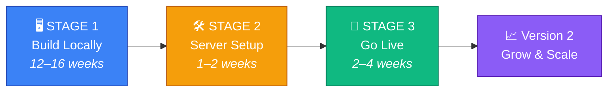

### 🧩 Tech Stack (fixed — don't switch mid-build)

| Layer | Choice | Why |
|---|---|---|
| 🎨 Frontend | **Next.js + Tailwind + shadcn/ui** | Fast to build, great dashboards, SEO for landing page |
| ⚙️ Backend API | **NestJS (Node + TypeScript)** | Structured, scalable, same language as frontend |
| 📞 Call Router | **Node/TypeScript service** (Go later if needed) | Must answer Telnyx webhooks in milliseconds |
| 🗄️ Database | **PostgreSQL + Prisma** | Reliable, relational, easy migrations |
| ⚡ Live state | **Redis** | Caps, concurrency, live calls — atomic & fast |
| 📬 Jobs/Queues | **BullMQ** | Postbacks, emails, transcription, retries |
| ☎️ Telephony | **Telnyx** | Cheaper than Twilio, good API |
| 💳 Payments | **Stripe** | Subscriptions + wallet top-ups |
| ✉️ Email | **Resend** (or Amazon SES) | Transactional emails |
| 🗂️ Storage | **Cloudflare R2** | Call recordings, no egress fees |

---

## 📅 2. Timeline

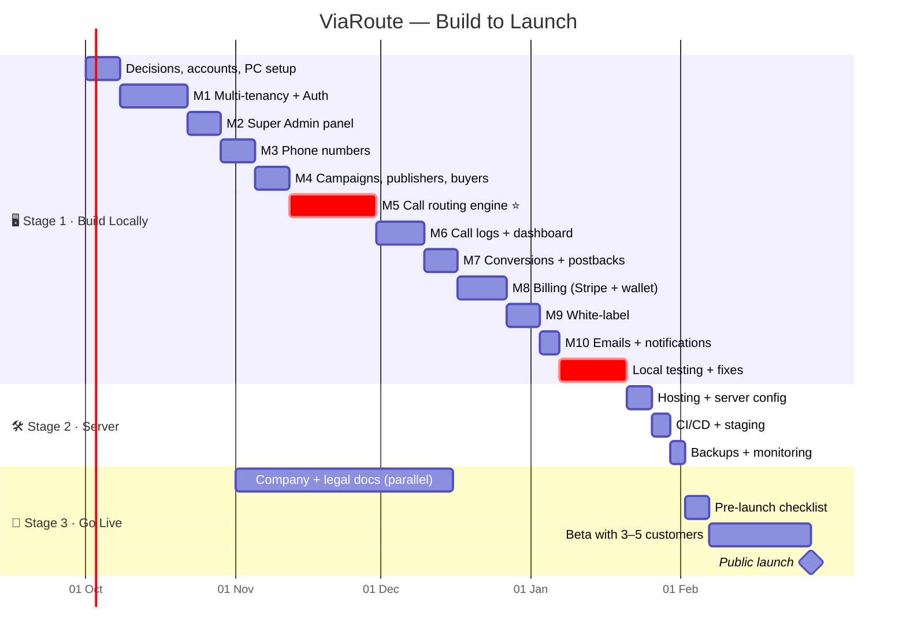

---

## 🏗️ 3. System Architecture

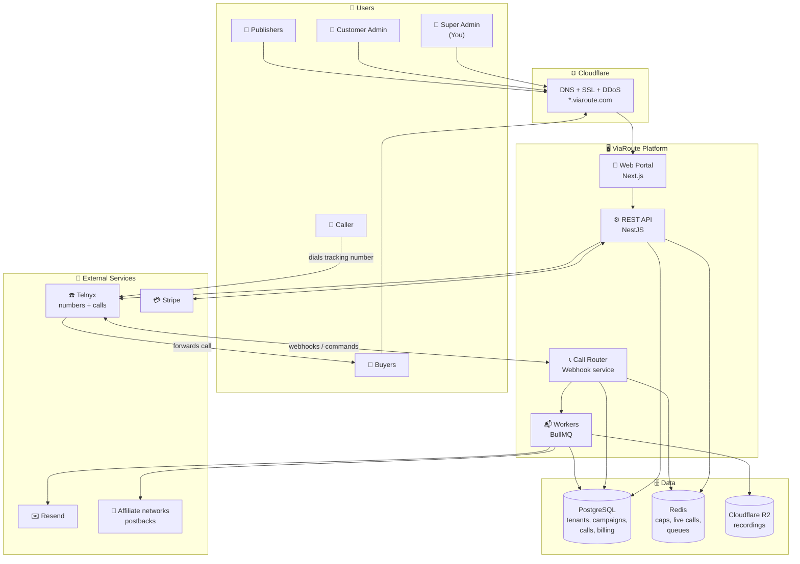

### 🏠 Multi-Tenant Model (how each customer gets their own portal)

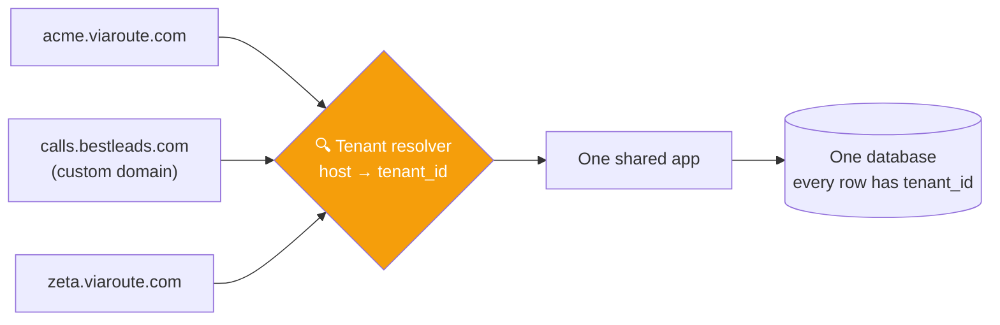

> 🔒 **Golden rule:** every database query MUST be filtered by `tenant_id`. Enforced automatically with a Prisma middleware + PostgreSQL Row-Level Security.

---

## 📞 4. How a Call Flows

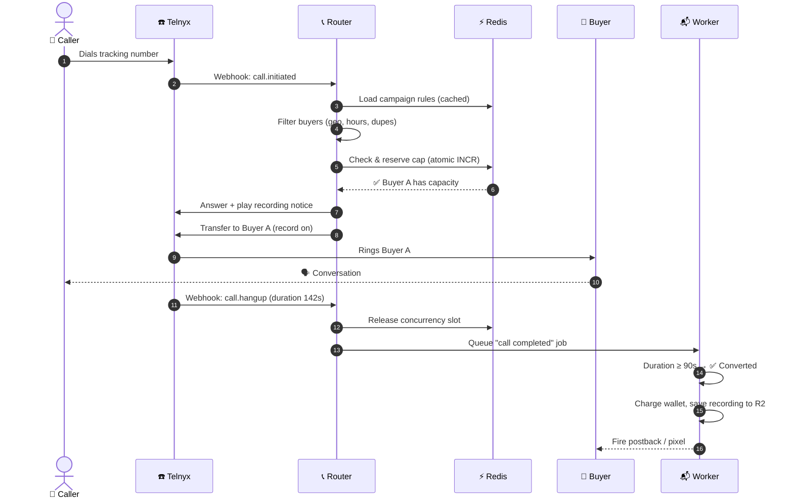

### 🔀 Routing Decision Logic

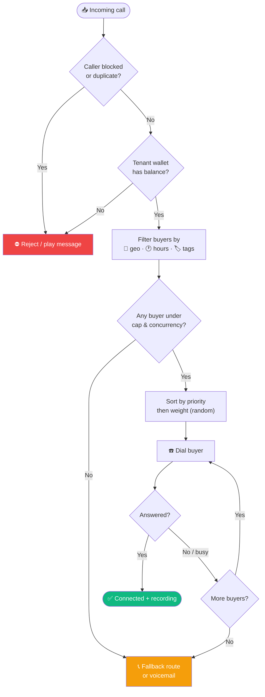

---

## 👥 5. Users & Roles

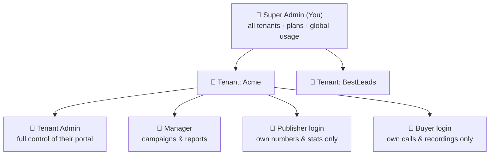

| Permission | 👑 Super Admin | 🔑 Tenant Admin | 👤 Manager | 📣 Publisher | 💼 Buyer |
|---|:-:|:-:|:-:|:-:|:-:|
| Manage all tenants & plans | ✅ | ❌ | ❌ | ❌ | ❌ |
| Billing & wallet | ✅ | ✅ | ❌ | ❌ | ❌ |
| Buy / release numbers | ✅ | ✅ | ✅ | ❌ | ❌ |
| Create campaigns & routing | ✅ | ✅ | ✅ | ❌ | ❌ |
| View all calls & reports | ✅ | ✅ | ✅ | ❌ | ❌ |
| View own calls / stats | ✅ | ✅ | ✅ | ✅ | ✅ |
| Listen to recordings | ✅ | ✅ | ✅ | ⚙️ optional | ✅ |
| Branding & custom domain | ✅ | ✅ | ❌ | ❌ | ❌ |

---

## 🗄️ 6. Database Design

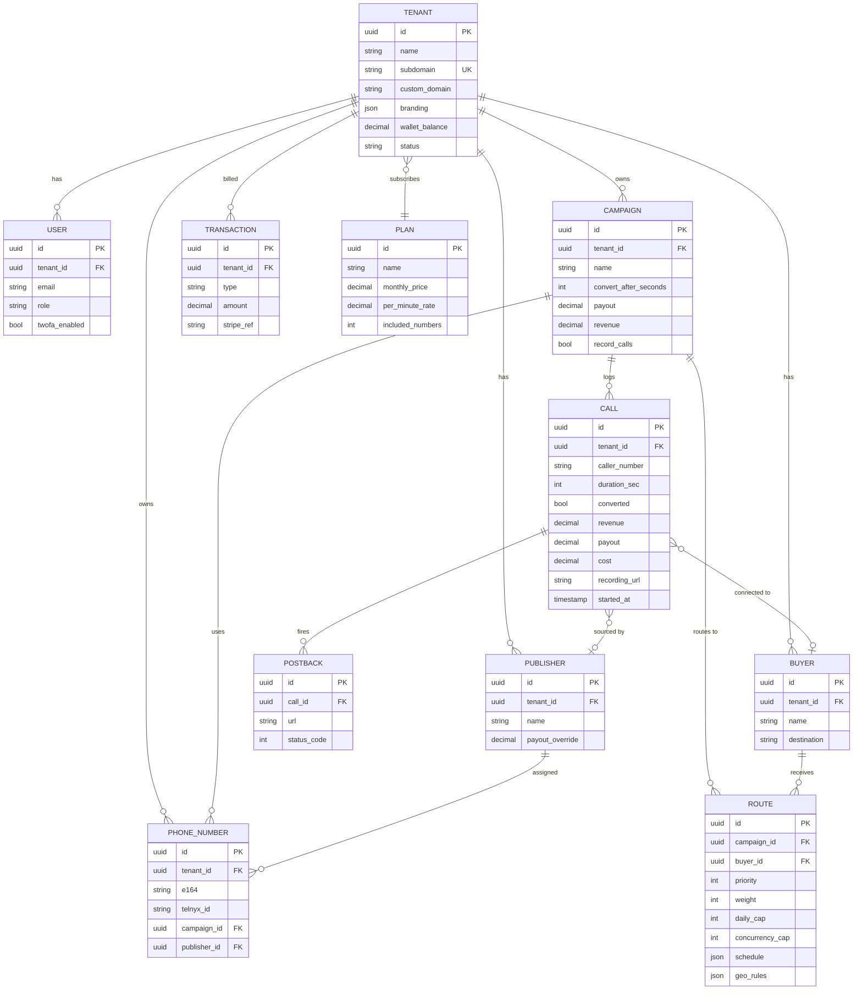

---

## 🖥️ STAGE 1 — Build Locally (12–16 weeks)

### Step 1 · Final decisions (Week 1)

- [ ] Confirm brand name + buy domain (e.g. `viaroute.com`)
- [ ] Define pricing plans

| Plan | Price / month | Numbers incl. | Per-minute | Users | White-label |
|---|---|---|---|---|---|
| 🥉 Starter | $99 | 5 | $0.025 | 3 | ❌ |
| 🥈 Pro | $299 | 25 | $0.020 | 10 | ✅ subdomain |
| 🥇 Enterprise | Custom | Custom | Custom | Unlimited | ✅ custom domain |

### Step 2 · Create accounts (Week 1)

| Service | Purpose | Mode now |
|---|---|---|
| GitHub | Code + CI/CD | Private repo |
| Telnyx | Numbers & calls | Test / small credit |
| Stripe | Payments | Test mode |
| Cloudflare | Domain & DNS | Free |
| Resend | Emails | Free tier |
| Sentry | Error tracking | Free tier |

### Step 3 · Windows PC setup (Week 1)

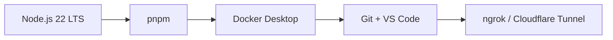

- [ ] **Node.js 22 LTS**
- [ ] **pnpm** → `npm i -g pnpm`
- [ ] **Docker Desktop** (runs Postgres + Redis locally)
- [ ] **Git** + **VS Code** (+ extensions: Prisma, ESLint, Prettier, Mermaid preview)
- [ ] **ngrok** or **Cloudflare Tunnel** → gives your PC a public URL so Telnyx webhooks can reach it

### Step 4 · Project structure (Week 1)

```
viaroute/
├── apps/
│   ├── web/              🎨 Next.js portal (super admin + tenant portal + landing)
│   ├── api/              ⚙️ NestJS REST API
│   ├── router/           📞 Call routing webhook service
│   └── worker/           📬 Background jobs (postbacks, billing, recordings)
├── packages/
│   ├── db/               🗄️ Prisma schema + migrations + seed
│   ├── shared/           🧩 Shared types, validation (zod), utils
│   └── ui/               🎨 Shared UI components
├── infra/
│   ├── docker-compose.yml      local Postgres + Redis
│   ├── docker-compose.prod.yml production stack
│   └── Caddyfile               web server + SSL
├── .github/workflows/    🔁 CI/CD
├── .env.example
├── PLAN.md               📍 you are here
└── README.md
```

### Step 5 · Build modules (Weeks 2–14)

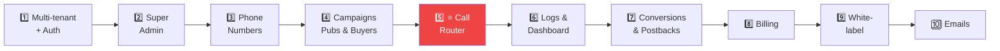

<details>
<summary><b>1️⃣ Multi-tenancy + Auth</b> — 2 weeks</summary>

- [ ] Tenant table + `tenant_id` on every business table
- [ ] Tenant resolver middleware (subdomain / custom domain → tenant)
- [ ] Prisma middleware that auto-adds `tenant_id` filter + Postgres Row-Level Security
- [ ] Signup (creates tenant + admin user), login, logout
- [ ] Email verification, forgot password
- [ ] 2FA (TOTP — Google Authenticator)
- [ ] Roles & permissions (see table in section 5)
- [ ] Invite team members
- [ ] Audit log (who changed what)
</details>

<details>
<summary><b>2️⃣ Super Admin panel</b> — 1 week</summary>

- [ ] List / search all tenants
- [ ] Create, suspend, delete tenant
- [ ] Manage plans & prices
- [ ] "Log in as tenant" (impersonation, for support)
- [ ] Global stats: calls, minutes, revenue, active tenants
</details>

<details>
<summary><b>3️⃣ Phone numbers</b> — 1 week</summary>

- [ ] Search available numbers (country, area code, toll-free)
- [ ] Buy via Telnyx API → charge wallet
- [ ] Release number
- [ ] Assign number to campaign + publisher
- [ ] Monthly number rental billing job
</details>

<details>
<summary><b>4️⃣ Campaigns, publishers, buyers</b> — 1 week</summary>

- [ ] Campaign CRUD (name, conversion seconds, payout, revenue, recording on/off)
- [ ] Publisher CRUD + payout overrides
- [ ] Buyer CRUD + destinations (phone number / SIP)
- [ ] Routes: buyer ↔ campaign with priority, weight, caps, schedule, geo rules
</details>

<details>
<summary><b>5️⃣ ⭐ Call routing engine</b> — 2–3 weeks (most critical)</summary>

- [ ] Telnyx Call Control webhook endpoint (verify signatures!)
- [ ] Load campaign + routes from Redis cache (fallback: Postgres)
- [ ] Filters: blocked numbers, duplicate caller window, geo (area code / state), business hours + timezone
- [ ] Atomic caps with Redis Lua (daily / hourly / monthly / concurrency)
- [ ] Priority → weighted random selection
- [ ] Failover: no-answer / busy → next buyer
- [ ] Fallback destination / voicemail
- [ ] Recording notice + dual-channel recording
- [ ] Hangup handler → release concurrency, queue completion job
- [ ] Unit tests for every rule ✅
</details>

<details>
<summary><b>6️⃣ Call logs + dashboard</b> — 1.5 weeks</summary>

- [ ] Live calls view (real-time via WebSocket/SSE)
- [ ] Call log table with filters + CSV export
- [ ] Recording player
- [ ] Charts: calls per hour/day, conversion rate, revenue vs payout vs profit
- [ ] Reports by campaign / publisher / buyer / number
</details>

<details>
<summary><b>7️⃣ Conversions + postbacks</b> — 1 week</summary>

- [ ] Conversion rule: duration ≥ X seconds
- [ ] Revenue & payout calculation per call
- [ ] Postback URLs with macros (`{call_id}`, `{duration}`, `{payout}`, `{click_id}`…)
- [ ] Retry failed postbacks (BullMQ)
- [ ] Postback log
</details>

<details>
<summary><b>8️⃣ Billing</b> — 1.5 weeks</summary>

- [ ] Stripe subscriptions (plans)
- [ ] Prepaid wallet + top-up via Stripe Checkout
- [ ] Auto-recharge option
- [ ] Usage deduction per minute / per number / per recording
- [ ] Low-balance alerts, auto-suspend routing at $0
- [ ] Invoices & transaction history
- [ ] Stripe webhooks (payment success / failure)
</details>

<details>
<summary><b>9️⃣ White-label</b> — 1 week</summary>

- [ ] Tenant logo, colors, portal name
- [ ] Custom domain: tenant adds CNAME → verify → auto-SSL (Caddy on-demand TLS)
- [ ] Branded emails (tenant name/logo)
</details>

<details>
<summary><b>🔟 Emails + notifications</b> — 0.5 week</summary>

- [ ] Welcome, verify email, reset password
- [ ] Low balance, cap reached, payment failed
- [ ] Monthly invoice
- [ ] In-app notifications bell
</details>

### Step 6 · Local testing (Weeks 14–16)

| Test | How | Pass when |
|---|---|---|
| 📞 Real calls | Call Telnyx test numbers from your phone | Routed correctly + recorded |
| 🔢 Caps under load | 2+ simultaneous calls to a cap-1 buyer | Cap never exceeded |
| 🔒 Tenant isolation | Log in as Tenant A, request Tenant B IDs via API | Always 404/403 |
| 💳 Billing | Stripe test cards (success, decline, 3DS) | Wallet & invoices correct |
| 💸 Zero balance | Drain wallet, make call | Call rejected gracefully |
| ⚡ Load | k6 script: 100 concurrent webhook flows | < 300 ms router response |
| 🔁 Postbacks | Point to webhook.site | Fired with correct macros + retries |
| 🤖 Automated | Unit + integration tests in CI | All green |

> ✅ **Stage 1 done when:** a new customer can **sign up → pay → buy number → create campaign → receive a routed call → see it in the dashboard** — all on your PC.

---

## 🛠️ STAGE 2 — Server Setup (1–2 weeks)

### Step 7 · Production infrastructure

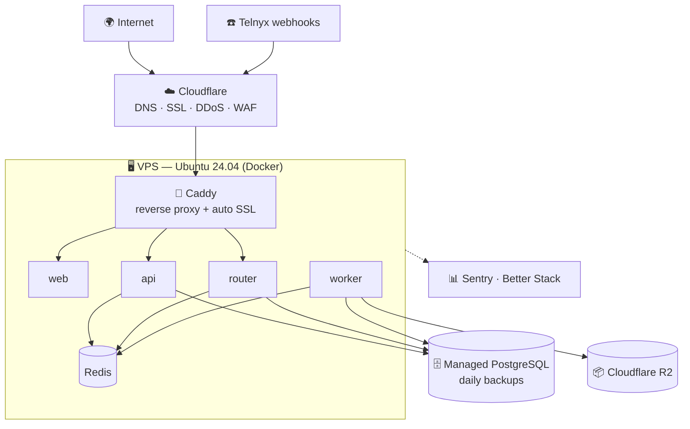

| Item | Service | ~Cost / month |
|---|---|---|
| App server | Hetzner / DigitalOcean VPS (4 vCPU, 8 GB) | $30–50 |
| Database | Managed PostgreSQL | $30–60 |
| Redis | On VPS (or managed) | $0–15 |
| Recordings | Cloudflare R2 | $5+ |
| DNS / SSL / DDoS | Cloudflare | Free |
| Errors | Sentry | Free tier |
| Uptime + logs | Better Stack | Free tier |
| **Total** | | **≈ $100–200** |

### Step 8 · Server configuration checklist

- [ ] Create VPS (Ubuntu 24.04)
- [ ] Create non-root user, SSH key login, **disable password login**
- [ ] Firewall (UFW): allow only `22`, `80`, `443`
- [ ] Install fail2ban + automatic security updates
- [ ] Install Docker + Docker Compose
- [ ] Configure Caddy (auto SSL + on-demand TLS for custom domains)
- [ ] Cloudflare DNS records:

| Record | Points to | Purpose |
|---|---|---|
| `viaroute.com` | VPS | Landing / marketing site |
| `app.viaroute.com` | VPS | Main login portal |
| `*.viaroute.com` | VPS | 🏢 Every tenant subdomain |
| `api.viaroute.com` | VPS | API + Telnyx webhooks |
| `status.viaroute.com` | Better Stack | Status page |

- [ ] Production secrets in server `.env` (never in GitHub)

### Step 9 · CI/CD pipeline

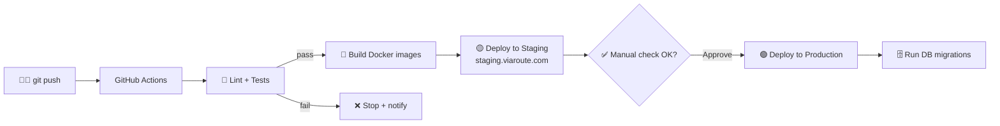

- [ ] GitHub Actions workflow: test → build → push images
- [ ] Staging environment (`staging.viaroute.com`, Telnyx/Stripe test keys)
- [ ] Production deploy with manual approval
- [ ] Zero-downtime deploy (health checks, rolling restart)

### Step 10 · Backups & monitoring

- [ ] Daily DB backups, 30-day retention
- [ ] 🔁 **Test a restore** at least once
- [ ] Sentry in web, api, router, worker
- [ ] Uptime checks every 1 min → SMS/Telegram alert
- [ ] Special alert: router down or error rate spike (customers lose money every minute!)
- [ ] Centralized logs (Better Stack / Grafana Loki)

---

## 🚀 STAGE 3 — Go Live (2–4 weeks)

### Step 11 · Legal & compliance (start early, runs in parallel)

- [ ] Register company (LLC / Ltd) + business bank account
- [ ] Terms of Service
- [ ] Privacy Policy (GDPR-ready)
- [ ] Acceptable Use Policy (no spam, no robocalls, no illegal verticals)
- [ ] Data Processing Agreement (for EU customers)
- [ ] Call recording consent notice (two-party consent states)
- [ ] Telnyx production account + business verification (KYC)
- [ ] STIR/SHAKEN registration via carrier
- [ ] Stripe live account activation

### Step 12 · Pre-launch checklist

| Area | Item | ✔ |
|---|---|:-:|
| 🔑 Keys | Stripe + Telnyx switched to **live** keys | ☐ |
| 🔒 Security | Rate limiting, CORS, helmet headers, HTTPS only | ☐ |
| 🔒 Security | Tenant isolation re-tested in production | ☐ |
| 🔒 Security | Webhook signature verification (Telnyx + Stripe) | ☐ |
| 📞 Calls | Real paid test calls end-to-end in production | ☐ |
| 🌐 Website | Landing page, pricing page, sign-up flow | ☐ |
| 📚 Docs | Help center / getting-started guide | ☐ |
| 💬 Support | Support email + live chat (Crisp / Tawk.to) | ☐ |
| 📊 Status | `status.viaroute.com` live | ☐ |
| 📈 Analytics | Product analytics (PostHog / Plausible) | ☐ |

### Step 13 · Launch sequence

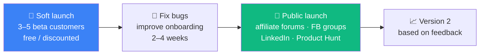

---

## ⚠️ Difficulties & Solutions

| # | Difficulty | Impact | Solution |
|---|---|:-:|---|
| 1 | Telecom costs eat margin | 🔴 High | Telnyx/SignalWire; cost-plus usage pricing; own carriers + FreeSWITCH later |
| 2 | Routing must be < 2 s | 🔴 High | Redis cache for rules; no heavy DB queries in call path; hard timeouts |
| 3 | Dropped calls = lost money | 🔴 High | Fallback routes, health checks, multi-carrier failover (v2), 24/7 alerts |
| 4 | Cap race conditions | 🟠 Med | Atomic Redis Lua scripts, never DB counters |
| 5 | Tenant data leak | 🔴 High | `tenant_id` middleware + Postgres RLS + automated isolation tests |
| 6 | Compliance (TCPA, recording, STIR/SHAKEN, GDPR) | 🔴 High | Consent notice, per-state rules, verified numbers, lawyer-reviewed terms |
| 7 | Call fraud / bots | 🟠 Med | Duplicate window, spam-score lookup, short-call flags, AI scoring (v2) |
| 8 | Competition (Ringba, Invoca, Retreaver) | 🟠 Med | Niche: lower price, vertical focus, regional (EU/MENA/Africa), better AI |
| 9 | Customer doesn't pay usage | 🟡 Low | Prepaid wallet only; auto-suspend at $0 |

---

## 💰 Costs

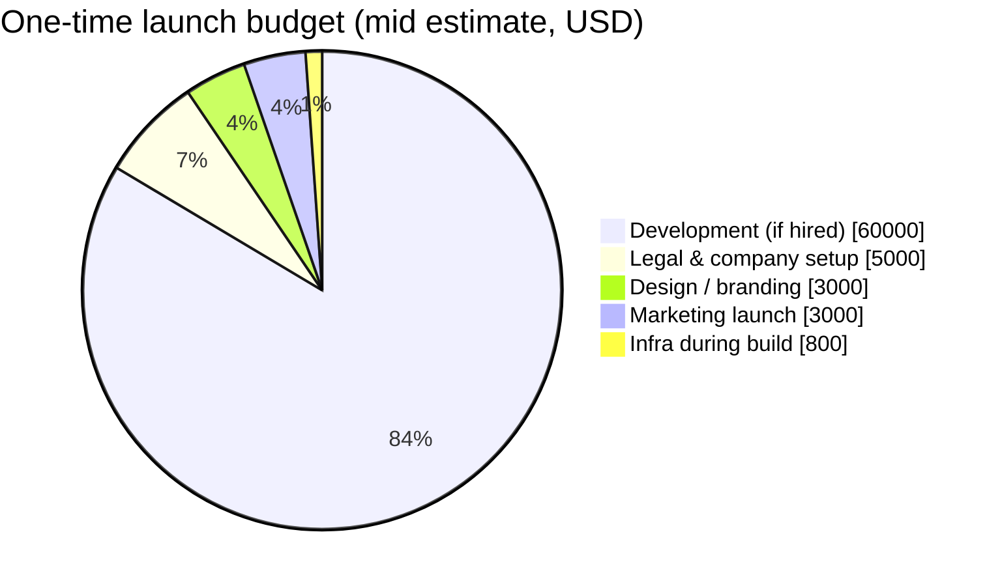

| Category | Low | High |
|---|---|---|
| 👨‍💻 Development (hired team) | $30,000 | $120,000 |
| ⚖️ Legal & company | $2,000 | $10,000 |
| 🎨 Design / branding | $500 | $5,000 |
| 📣 Launch marketing | $1,000 | $5,000 |
| 🖥️ Monthly infra (after launch) | $100 | $1,000 |
| ☎️ Telecom | ~$1 / number / month + ~$0.004–0.01 / min → **passed to customers with markup** | |

---

## 🔮 Version 2 Roadmap

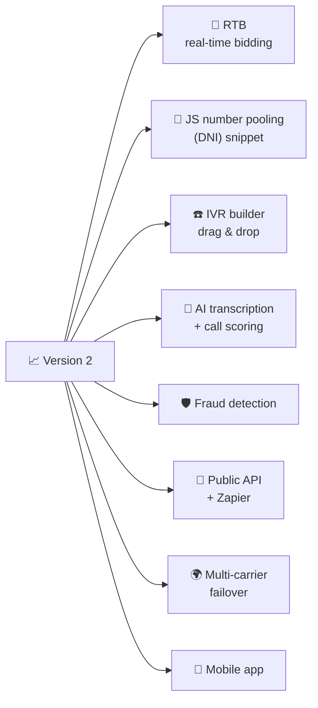

---

## ✅ Progress Tracker

| Stage | Step | Status |
|---|---|:-:|
| 🖥️ 1 | Step 1 · Decisions | ✅ |
| 🖥️ 1 | Step 2 · Accounts | ⬜ |
| 🖥️ 1 | Step 3 · PC setup | ✅ |
| 🖥️ 1 | Step 4 · Project structure | ✅ |
| 🖥️ 1 | Step 5 · M1 Multi-tenancy + Auth | ✅ |
| 🖥️ 1 | Step 5 · M2 Super Admin | ✅ |
| 🖥️ 1 | Step 5 · M3 Phone numbers | ✅ |
| 🖥️ 1 | Step 5 · M4 Campaigns / pubs / buyers | ✅ |
| 🖥️ 1 | Step 5 · M5 Call router ⭐ | ✅ |
| 🖥️ 1 | Step 5 · M6 Logs + dashboard | ✅ |
| 🖥️ 1 | Step 5 · M7 Conversions + postbacks | ✅ |
| 🖥️ 1 | Step 5 · M8 Billing | ✅ |
| 🖥️ 1 | Step 5 · M9 White-label | ✅ |
| 🖥️ 1 | Step 5 · M10 Emails | ✅ |
| 🖥️ 1 | Step 6 · Local testing | ✅ |
| 🛠️ 2 | Step 7 · Infrastructure | 🟨 |
| 🛠️ 2 | Step 8 · Server config | 🟨 |
| 🛠️ 2 | Step 9 · CI/CD | 🟨 |
| 🛠️ 2 | Step 10 · Backups + monitoring | 🟨 |
| 🚀 3 | Step 11 · Legal & compliance | ⬜ |
| 🚀 3 | Step 12 · Pre-launch checklist | ⬜ |
| 🚀 3 | Step 13 · Launch | ⬜ |

> Legend: ⬜ Not started · 🟨 In progress · ✅ Done

### 📝 Build log

**2026-09-25: Foundation ✅**
- ✅ Monorepo (pnpm workspaces): `apps/api`, `apps/web`, `packages/db`, `infra/`
- ✅ Postgres 17 + Redis 7 in Docker
- ✅ Full database schema (tenants, plans, users, campaigns, buyers, routes, numbers, calls, postbacks, transactions, audit log) + seed data
- ✅ `tenantDb()` client that automatically filters every query by `tenantId`
- ✅ Customer portal detection by subdomain / custom domain
- ✅ Sign up → own portal (`name.localhost:3000`), login, logout, secure handoff between domains
- ✅ Tokens locked to their own portal (Acme token rejected on other portals: tested)
- ✅ Login rate limiting, helmet security headers, CORS limited to own domains
- ✅ Customer dashboard + Super Admin overview (list, suspend, reactivate customers)
- ✅ End-to-end browser tests passing

**2026-09-25: Module 1 complete ✅**
- ✅ Email verification (banner + resend), branded emails, Mailpit local inbox
- ✅ Forgot / reset password (1-hour one-time links, only hashes stored, logs out all sessions)
- ✅ Change password (logs out other devices)
- ✅ Two-factor authentication (QR code, secrets encrypted with AES-256-GCM)
- ✅ Team: invite by email, roles (Admin / Manager), resend, remove, plan user limits, last-admin protection
- ✅ Every request re-checks the account: removed users and role changes apply instantly
- ✅ Automated API test suite: 27 tests incl. tenant isolation (`pnpm test`)
- ✅ Browser tests for all flows incl. mobile

**Moved to pre-launch hardening (Step 12):** Postgres Row-Level Security as a second safety net, TOTP code replay protection, 2FA backup codes
**M2 still to do:** manage plans · log in as customer · usage charts

**2026-09-25: Module 3 complete ✅** (in test mode until a Telnyx key is added)
- ✅ Carrier layer: Telnyx provider + simulated provider (auto-selected by `TELNYX_API_KEY`)
- ✅ Search local (by area code) and toll-free numbers; never sells a number that costs more than its price
- ✅ Buy: only numbers the customer was quoted (held 15 min in Redis), email must be confirmed
- ✅ Plan-included numbers are free; beyond that the first month is charged from the wallet
- ✅ Prepaid wallet with ledger; atomic debit (tested with parallel purchases), automatic refund if the carrier rejects
- ✅ Pending carrier orders are completed automatically
- ✅ One owner per number at a time (database rule); released numbers can be bought again
- ✅ Rename, release, link to campaign/publisher (UI for linking comes with M4)
- ✅ Super Admin: add/remove wallet credit with reason
- ✅ 45 API tests + browser tests passing

**Before going live with Telnyx:** add `TELNYX_API_KEY` and test one real purchase + release · monthly number rental billing is part of M8

**2026-09-25: Modules 2, 4–10 + local testing complete ✅ — Stage 1 done**
- ✅ **M4** Campaigns, publishers (payout, postback URL), buyers (phone/SIP, ring time), routes (priority, weight, 4 cap types, business hours, states, revenue override), caller blocklist, publisher & buyer logins that only see their own calls
- ✅ **M5** Call router: carrier-independent `CallEngine` fed by **Telnyx webhooks** (Ed25519-verified) or the built-in **call simulator**; recording notice, failover, fallback number, atomic Redis caps, repeat callers, per-call locking, duplicate-webhook safety
- ✅ **M6** Call logs (filters, live calls, CSV export, recording player via signed links), dashboard charts, breakdowns; reports hide the money side a partner shouldn't see
- ✅ **M7** Conversions (talk-time threshold), revenue/payout, per-minute usage charged in the same DB transaction as the call result, publisher postbacks with macros + retries (BullMQ)
- ✅ **M8** Billing: wallet top-ups (Stripe Checkout + signed webhook, idempotent; instant in test mode), 14-day trial, monthly plan + number renewal from the wallet, auto-suspend / auto-reactivate, plan changes, statements, low-balance alerts
- ✅ **M9** White-label: portal name/color/logo, custom domains with DNS verification, CORS + Caddy on-demand TLS gate
- ✅ **M10** Notifications: in-app bell + emails (low balance, suspended, payment receipts, invites, verification, resets)
- ✅ **M2** Plans editor, "log in as customer" support mode (1 h, banner, audit log), platform income/calls charts
- ✅ **Step 6** 98 automated API tests · browser tests for every screen incl. mobile · load test: 100 simultaneous calls, caps exact, billing exact, p95 268 ms
- 🐛 Found & fixed by testing: webhooks were rate-limited (would drop real calls), call result and charge weren't atomic, stale session could overwrite a support login, recordings blocked cross-origin, existing accounts would be charged on first billing run

**2026-09-25: New UI — design A ✅**
- ✅ Calmer theme (warm neutrals, ink buttons, one data blue, dark mode), Geist font, Lucide line icons on every page — no emoji
- ✅ New app shell: white sidebar with grouped icon nav + live-call badge, wallet card, top-bar search, notifications; phone drawer + bottom tabs
- ✅ Dashboard: greeting + summary, date range, headline figures with trends and comparisons, calls/revenue/profit by hour or day, live calls, campaign table, buyer capacity, quick actions
- ✅ API: hourly report breakdown + `/reports/capacity` (99 API tests passing)

**Stage 2 prepared 🟨** (needs your server): Dockerfiles (both built and run locally), production Compose + Caddy (validated), GitHub Actions CI/CD with staging → approval → production, `create-admin` command, step-by-step **[DEPLOY.md](DEPLOY.md)**

**Reporting upgrade ✅** — **Reports** page: CDR download with 11 filters, a column chooser (by role), preview, and times in any timezone; summary report by day/hour/campaign/publisher/buyer/number/state with CSV. **Live calls** board: grouped by buyer (or campaign/publisher), sort, filters, line usage vs caps, 2s refresh. App-wide **date & time range picker**: two-month calendar, 11 presets, timezone, remembered across pages (Dashboard, Call logs, Reports). Branding and custom domains are now managed by the platform admin (Customers → customer page), not by customers. Each user can set a personal default timezone (Settings → Preferences).

**Targets & repeat-caller routing ✅** — **Targets** page: send calls straight to a number/SIP address, either a buyer's extra call center or a **direct** target with no buyer; each has its own ring time and line limit shared across campaigns. Campaign routes go to a buyer's main line or a target. **Repeat callers** (campaign setting): send to a different buyer/target if available (default), the same one, or ignore history. A buyer pays once per caller, so a repeat sent to a new buyer is a new sale; the publisher isn't paid twice. Reports/CDR/live board show targets. Targets and buyers: type **Number or IP** (IP/host[:port] or SIP URI), **hourly/daily/monthly/concurrent caps with on/off switches** counted across all campaigns (buyer caps cover the main line and all its targets), target **priority** (default when added to a campaign). Campaign routes use the same cap switches. 112 API tests passing.

**Admin customer management ✅ (Phase A)** — customer list with search/filters/sort/CSV, create customer + owner invite, customer page with tabs: overview, plan & limits (custom per-minute/number prices, included numbers, concurrent-call and number limits), wallet with refunds, usage charts, users (reset password, resend invite, turn off 2FA, sign out, disable), numbers (move between customers, release), branding & domain, internal notes, activity log. Suspend with a reason shown to the customer (top-ups don't lift it), close (releases numbers) and reopen. 126 API tests passing.

**Carrier management ✅ (Phase B)** — Admin → Carriers: Telnyx accounts and a Test carrier, encrypted API keys (never shown again), test-connection, per-carrier webhook URL checked with that account's public key, Active / Draining / Off, default carrier and per-customer carrier. Every call records carrier cost; margins per carrier, customer and platform (gross margin on the admin dashboard). The first carrier is created from .env automatically. **Custom API carriers**: any carrier/softswitch plugs in through the ViaRoute Carrier API (docs/CARRIER_API.md) with HMAC-signed webhooks and an optional numbers API; admins can add existing numbers to customers. **Twilio, SignalWire, Plivo, Bandwidth and Vonage** carriers through one conference-based adapter (TwiML / Plivo XML / BXML / NCCO). 142 API tests passing.

**Spam protection ✅** — per-campaign rules (hidden IDs, prefixes, calls per caller, STIR/SHAKEN grade, spam score, auto-block short-call spammers), platform blocklist, IPQualityScore lookups, Spam & blocking pages for customers and admin. Blocked calls are never billed. 150 API tests passing.

**Next: see [IMPROVEMENTS.md](IMPROVEMENTS.md)** for the full improvement plan (admin customer management → provider management → hardening).

**Still for later (v2 / pre-launch hardening):** RTB, number pooling (DNI) JS snippet, IVR builder, AI transcription/scoring, Stripe auto-recharge, recordings on Cloudflare R2, Sentry, Postgres Row-Level Security, 2FA backup codes

---

*Last updated: 2026-09-25*
